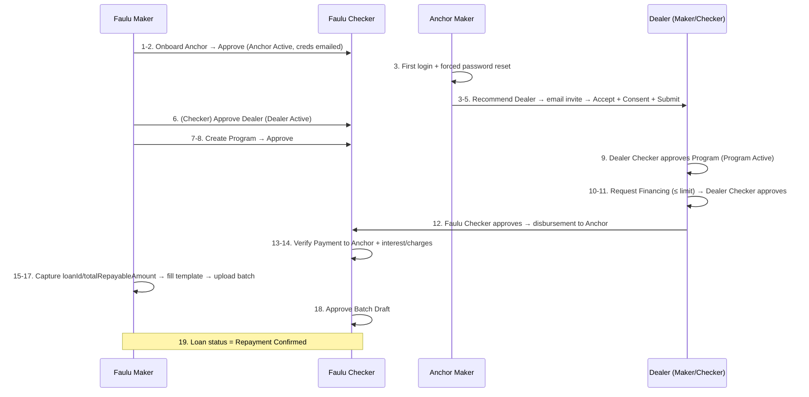

# Faulu Dealer Financing — End-to-End Flow

This is the authoritative description of the business flow under test, refined
from the Product Guide and a manual walkthrough of the live platform. It
supersedes the generic flow sketch in the README.

**Platform:** Emtech Supply Chain Finance platform.
**FI/Bank under test:** Faulu.
Everything is Maker-Checker: a Maker initiates, a Checker of the same
organization approves via **View → Update Status → Approve/Reject**.

## Actors and credentials

Usernames live in `.env` (never commit real passwords — see `.env.example`).

| Actor | Maker | Checker | Notes |
|---|---|---|---|
| Platform Admin (Emtech) | `emtech@maker.co.ke` | `emtech@checker.co.ke` | Boards FIs onto the platform |
| FI — Faulu | `faulumaker@yopmail.com` | `fauluchecker@yopmail.com` | Onboards Anchors, approves Dealers, creates Programs, approves loans, processes repayments |
| Anchor | *(created during flow)* | *(created during flow)* | Operators receive **first-time credentials by email** and must force-reset their password on first login |
| Dealer | *(created during flow)* | *(created during flow)* | Created from an **email invitation link** (accept → consent → submit form) |

> Anchor and Dealer inboxes are `@yopmail.com` addresses, so automation can
> poll the public yopmail web inbox to fetch first-time credentials and
> invitation URLs.

## Domain objects and their lifecycles

- **Anchor** — corporate buyer onboarded by Faulu. `Pending → Active` (Faulu Checker approves).
- **Dealer** — supplier recommended by the Anchor, accepts an invitation, approved by **Faulu** Checker (not the Anchor checker). `Invited → Pending → Active`.
- **Program** — Faulu's financing offer to a Dealer: revolving limit, interest, charges. Becomes **Active only after BOTH Faulu Checker and Dealer Checker approve** — the Dealer Checker's approval *is* the Dealer accepting the offer.
- **Loan** — financing requested by the Dealer Maker within the Program limit. Needs **two approvals**: Dealer Checker (internal), then Faulu Checker (triggers disbursement to the Anchor). Ends at `Repayment Confirmed`.
- **Repayment Batch** — a file upload (template: `loanId`, `amount`, optional third column) by Faulu Maker; sits as a **Batch Draft** until Faulu Checker approves, which applies the transactions against the loans.

## The flow, phase by phase

### Phase 1 — Anchor onboarding (steps 1–2)

| # | Actor | Action | Expected result |
|---|---|---|---|
| 1 | Faulu **Maker** | **Anchors → Onboard Anchor**, fill and submit the form | Anchor listed as pending approval |
| 2 | Faulu **Checker** | **Anchors → View Anchor → Update Status → Approve** | Anchor is **Active**; Anchor operators (maker & checker) receive first-time login credentials by email |

### Phase 2 — Dealer onboarding (steps 3–6)

| # | Actor | Action | Expected result |
|---|---|---|---|
| 3 | Anchor **Maker** | First login → **forced password reset** → re-authenticate with the new password → **Dealers → Recommend New Dealer** → log out | Dealer receives an invitation email |
| 4 | Dealer | Open the invitation URL from the email | Invitation page loads |
| 5 | Dealer | **Accept Invitation → Consent → Submit** the registration form | Dealer submitted for approval |
| 6 | Faulu **Checker** | **Dealers → View New Dealer → Update Status → Approve** | Dealer is **Active** |

**Checkpoint:** Anchor and Dealer are both Active; their makers and checkers can
all log into the platform.

### Phase 3 — Program creation and acceptance (steps 7–9)

| # | Actor | Action | Expected result |
|---|---|---|---|
| 7 | Faulu **Maker** | **Programs → Create New Program** (dealer, revolving limit, interest, charges) | Program pending approval |
| 8 | Faulu **Checker** | **Programs → View Program → Update Status → Approve** | Faulu side approved |
| 9 | Dealer **Checker** | **Programs → View Program → Update Status → Approve** | Dealer has accepted the offer — Program is **Active**, revolving limit available |

### Phase 4 — Financing request and disbursement (steps 10–14)

| # | Actor | Action | Expected result |
|---|---|---|---|
| 10 | Dealer **Maker** | **Loans → Request Financing** | Request created. **Validation to assert: an amount greater than the Program limit must be rejected** |
| 11 | Dealer **Checker** | **Loans → View Loan → Update Status → Approve** | Loan request validated internally by the Dealer org |
| 12 | Faulu **Checker** | **Loans → View Loan Request → Approve** | Approval **triggers disbursement of funds to the Anchor** |
| 13 | Faulu | **Payments** | A payment to the **Anchor** is visible |
| 14 | Faulu | **Transactions** | Interest and charges match what was agreed on the Dealer's **Program** |

### Phase 5 — Loan repayment via batch upload (steps 15–19)

| # | Actor | Action | Expected result |
|---|---|---|---|
| 15 | Faulu **Maker** | **Loans** — capture `loanId` and `totalRepayableAmount` for the new loan (e.g. `SM-…`) from the *Get Loan Requests* API response | Values captured. *(Manually: DevTools → Network tab. In automation: intercept the response — see notes below)* |
| 16 | Faulu **Maker** | **Repayments → Upload File → Download the Template**; fill it: first column = `loanId`, amount column = `totalRepayableAmount`, last column optional | Template ready |
| 17 | Faulu **Maker** | Upload the file | Transactions uploaded as a **batch** (Batch Draft) |
| 18 | Faulu **Checker** | **Repayments → table dropdown → Batch Drafts → View** the new draft → **Approve** | Batch applied — transactions repay the loan |
| 19 | Any Faulu user | **Loans** | Loan status is **Repayment Confirmed** |

## Sequence overview

## Automation notes

- **Email-driven steps (2, 3, 4):** first-time Anchor credentials and the Dealer
  invitation URL arrive at `@yopmail.com` inboxes. Automate by opening
  `https://yopmail.com/?<inbox>` in a Playwright page and extracting the
  credentials/link from the newest message.
- **Forced password reset (step 3):** the Anchor Maker's first login lands on a
  reset screen; the login helper must detect it, set a known password, and
  re-authenticate. Persist the new password for later steps in the run.
- **Loan details (step 15):** don't scrape DevTools — register
  `page.waitForResponse()` for the *Get Loan Requests* endpoint while opening
  the Loans page, then read `loanId` and `totalRepayableAmount` from the JSON.
- **Repayment template (step 16):** download via Playwright's `Download`
  handle, fill with Apache POI (xlsx) or plain CSV writing, upload with
  `setInputFiles()`.
- **Ordering:** the whole journey is strictly sequential and state-carrying
  (Anchor creds → Dealer invite → Program → Loan → Batch). It must run
  single-threaded, with entity identifiers passed between steps.
- **Key assertions to not skip:** over-limit loan rejection (step 10), payment
  to Anchor exists (13), interest/charges match Program terms (14), final
  status `Repayment Confirmed` (19).
